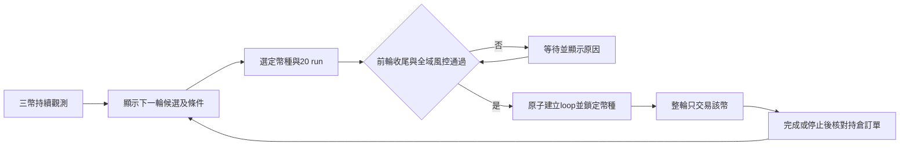

# 三幣種整輪切換設計 v1

狀態：已實作候選，尚未部署正式Live。依2026-10-04使用者要求，以T6.7c支援整個loop切換，新增目標為BNB／ETH。下文記錄設計與後續階段；本版實際操作與部署範圍見 [操作說明](T6_7C_MULTIMARKET.md)。

## 產品範圍

- 三幣觀測器持續收集BTCUSDT／ETHUSDT／BNBUSDT；正式交易同時間只允許一個Live loop、一個幣種。
- 建議每輪20 run，使用 `/predict_loop 20` 明確指定，不更改舊指令預設；可在啟動前選定既有允許的target。20場5分鐘市場約100分鐘，資料缺漏、等待結算或風控可能使時間延長或提前結束。
- 每輪開始時凍結symbol、profile、策略指紋、執行規則、unit與target。輪內不變更symbol；中途選別的幣只更新「下一輪候選」。
- 首版提供TG手動選幣及既有三幣First觀測，完整T6.7c跨幣排序留待後續。自動選幣只在未來明確啟用selector模式後於輪次邊界執行；選幣不等於arm或建立新輪。
- 可選BTC／ETH／BNB；新增觀測排序的目標池為ETH／BNB，BTC保留基準與手選能力，資料不足不自動fallback到BTC。

## 子策略範圍

使用者已明確指定以 **T6.7c** 為基底。首版完整保留其7條Live子策略、核心優先及增量補位規則；不改為First-only，不加入T6.7d的Flat或T6.8的180秒補位。來源為 `regime_t67c_policy.py` 與 `regime_t67c_bridge.py`。

|層級|子策略|本次範圍|
|---|---|---|
|核心|First DOWN、First UP、Stall DOWN、C DOWN、Continuation Original|完整移植至選定幣種，保留原條件與優先順序|
|增量|C mirror UP prior、Shallow retracement（淺回撤）|只有核心經驗證為空時才能補位；核心有候選但未成交不能直接轉增量|
|既有Shadow|External lead/lag、Reference value|保留觀測身份與不占Live claim的隔離；若跨幣資料源未完成，不產出該幣有效評分，也不升為Live|

執行語義沿用T6.7c：124–126秒初始核心凍結、最晚134.5秒選擇、124–136秒入場、盤口最大1秒陳舊度、增量quote TTL 2秒；核心到136秒截止。沿用1/2/3U選擇及原門檻，C的0.65下限維持。BTC同一證據的候選集合、優先順序、凍結價格／份數及不入場原因須與既有版一致。

實作保留 `regime_target6_7c_v1` 策略profile與既有風控鍵，另以不可變loop binding保存asset、unit、target及包含parent策略指紋的獨立execution fingerprint。報表按loop綁定幣種讀取資料，避免把BTC既有績效與ETH／BNB試行混為一個樣本。這是多幣適配，不借機改策略條件；沿用最新已修正的送單、取消、晚到成交、共享請求限制及對帳鏈，不能回退到舊T6.7c整包runtime。

跨幣需要涵蓋全部7條Live策略的輸入，尤其Original的JEV問題、K線、reference與官方市場身份均須來自同一幣，不能把ETH／BNB盤口接到BTC訊號。現有三幣First觀測器仍可作First活躍度參考，但不足以選出整套T6.7c的最佳市場；自動選幣前必須增加同規則的完整T6.7c三幣唯讀評估與盤口驗證。

## TG 流程

1. 進入「下一輪市場」，顯示目前幣種、下一輪候選、目前loop狀態。
2. 選擇BTC／ETH／BNB與target（預設20）；RUNNING期間顯示「下一輪使用」，不作用於正在執行的loop。
3. 啟動畫面列出幣種、策略集合、unit、target、當前風控及官方持倉／訂單核對結果。沿用現有Live啟動權限及一次性確認，不新增第二個bot接收器。
4. 通過切換條件後，建立新loop並把幣種鎖定；下單前再次比對loop綁定。
5. 到target或既有風控停止後，進入收尾；完成本地與官方對帳才開放下一輪啟動。

取消loop不代表可立即切換。已送出而取消中的單、晚到成交、UNKNOWN、未結持倉、未完成claim／結算都必須先核對。HS與MDD停止不因換幣解除。

## 觀測排序與自動化邊界

首版將最近20場作近期讀數、40／100場作穩定性參考，所有幣使用相同時間窗及相同策略指紋。目前First觀測只標示First子集；完整T6.7c評估器完成後，才可按整套核心保留與增量補位結果排序，不能把7條候選直接相加當作成交場次。排序依序看：

1. 健康與資料完整度，缺資料的幣不能以較少分母取得優勢。
2. 實際通過完整盤口重檢的候選率，而非只看反轉訊號數。
3. 初始合格到重檢的保留率、報價年齡與深度問題。
4. 近期與較長窗口是否方向一致。

WR／PnL／MDD保留展示，但不因單筆大賺就自動切幣。此前三天ETH／BNB只有K線可回看，舊盤口不足，因此目前不能聲稱哪個幣的Live預期PnL較高。

自動selector屬第二階段：預先固定資料門檻、最低樣本、候選率門檻、平手規則與切換差距，使用每輪開始前已知的快照決定，整輪不更新選擇。數值需以實際收集盤口的按時間前推驗證設定，不能從該輪後來的盈利反推贏家。兩者不足時輸出WAIT，保留人工手選能力與正常風控；不將觀測排序暗中變成自動啟動。

## 程式盤點：不能只改環境變數

|位置|目前行為|必要變更|
|---|---|---|
|`settings.py`、`predict_main.py`|市場由程序設定注入|Live發現、行情及下單都讀同一個已持久化loop綁定，程序預設值不能覆蓋恢復中的loop|
|`spot.py:19`|同步Spot來源只允許BTCUSDT／ETHUSDT|新增BNBUSDT及回傳symbol驗證；各symbol隔離cache、冷卻及過期狀態|
|`regime_feature_service.py:24`、`:42`|K線固定BTC；features以start為唯一鍵|新增帶symbol的資料域，按symbol收集，決策讀取時核對symbol、截止時間與指紋|
|`regime_lane.py:41`|凍結特徵source固定BTC字串|明確傳入及保存symbol；歷史BTC數據維持原身份|
|`c180_signal_runtime.py:599`、`:636`|市場選擇固定BTC，timeline按start索引|T6.7c全部輸入依symbol隔離，提供該幣官方metadata及full-depth books|
|`c180_jev_client.py:38`|Original問題明寫BTC|Original依symbol生成與驗證模型輸入／指紋，不沿用BTC文字或資料|
|`telegram.py:118`|T6 lane限制BTC|新增T6.7c多幣profile能力表，不直接刪除所有既有BTC-only限制|
|`repository.py:285`|start_loop保存mode/profile，未綁定symbol|新增不可變loop symbol binding；建立與恢復都驗證|
|`MarketInfo`、worker發現與下單|已有symbol過濾，canonical market尚未明列symbol|新增完整市場身份、priceFeedSymbol檢查，slot/claim/intent/下單前均比對loop symbol與token|
|feature/signal/report各讀取點|多處只按start查資料、按路徑推正式DB位置|以symbol+時間隔離；正式交易DB使用明確參數，不因改目錄而讀錯DB|

## 持久化與資料隔離

新增版本化表 `prediction_loop_market_bindings`：loop_id主鍵／外鍵、symbol、profile、execution_fingerprint（含parent策略指紋與資料隔離版本）、unit、target、selected_at_ms。綁定與新loop建立在同一事務完成，SQL trigger禁止修改／刪除。selector快照與自動選擇欄位留待後續版本，不以不存在的觀測排名啟動Live。

選擇新的多幣資料表或獨立多幣DB，不重用舊表只有start的主鍵：features鍵為(symbol,start)；books用(symbol,start,topic,market/token,captured_at)；decisions用(loop_id,symbol,start)。TTL／重試／discovery cache同樣含symbol。

正式交易帳本仍共用；不能每換一個幣就換一份交易DB，否則全域風控和帳戶曝險會被拆開。保留slot／claim的(loop_id,start)唯一性，並保留現有`idx_regime_one_market`的全域start互斥，因首版同時只交易一個幣。加入全域單一RUNNING Live的事務檢查，並發TG請求只能成功建立一輪。

歷史沒有symbol綁定的loop按已保存市場metadata明確驗證後才標記BTC；不能無條件把所有舊資料填成BTC，也不能依新選單值重解釋舊PnL。

## 執行與風控

- 單一交易worker切換其loop context；幣別切換只在空檔重建Spot／行情訂閱與清理該worker的市場cache，不重啟bot、不另開可同時下單的worker。
- BNB／ETH各自核對官方topic、symbol、priceFeedSymbol、5分鐘起止時間、UP/DOWN市場與token、reference、fee、最小份數與tick規則。不以BTC metadata或fee fallback。
- 繼承既有全域HS、日損／連虧、共用20-run風控與單輪MDD的規則與數值。帳戶的全域風控跨幣承接，不以symbol建立可繞過既有停止狀態的新risk key。
- 正常新輪的單輪MDD依原規則初始化；不藉建立新輪或切幣清除全域風控或未解除的停止狀態。
- 第一版驗證建議1U，金額由啟動前的既有選擇流程鎖定。不得從觀測PnL放大金額。
- 重啟從DB恢復已鎖定symbol。若runtime資料域與loop不同、binding缺失或資料過期，停止新增入場並顯示原因；不默認回BTC。
- 首版執行方式仍需實作驗證。研究觀測器只提供資料與比較，不能把`sim_quote`列直接轉成真實訂單；Live鏈路獨立執行最新報價／帳戶檢查。

## TG 報表

Live首頁明示：`T6.7c Live | BNB | loop:<id> | 7/20`。`/firstreport`保留三幣觀測；Live report顯示本輪幣種、策略集合、實際成交市場／已結束登錄市場、7條Live子策略各自的成交數／WR／PnL、單輪及全域風控。

每20run摘要按「幣種 × loop × 子策略」歸因；同一窗口的三幣觀測僅作對照，與正式成交結果各有標籤。換幣後可查看舊輪，不能因當前symbol改變而查不到舊BTC／ETH／BNB帳本。

## 建議實作順序與驗收

1. **資產與資料綁定**：loop binding事務、三幣metadata、Spot白名單、symbol隔離的features/books、重啟恢復與向後相容。先以無交易工具驗證資料一致性。
2. **T6.7c全策略適配**：7條Live策略與核心優先／增量補位、Original跨幣模型輸入、新profile指紋，接最新已修正的送單／取消／late-fill／claim／結算／風控；驗證BNB及ETH官方市場身份，新增整套三幣唯讀評估。
3. **TG整輪切換與報表**：下一輪選幣、輪內變更只排下一輪、target與unit鎖定、按幣種與loop歸因。
4. **部署驗證**：本地與VM候選測試、完整release inventory/pin、正式源碼備份；於無其他RUNNING loop與帳戶曝險清空的空檔部署。進入Live仍使用使用者明確選定的幣種與既有啟動操作。

必須覆蓋的驗收案例：

- 同一start同時存在BTC／ETH／BNB證據，任何一幣不得讀到另兩幣特徵或盤口。
- loop為BNB而回傳ETH topic／token／reference時不下單；缺market identity或fee也不下單。
- 切幣請求與啟動請求並發、重複TG callback、程序重啟，都只能有一個綁定及一個Live loop。
- RUNNING第7/20場選ETH，該輪仍完成原BNB身份；下一輪開始才鎖ETH。
- CANCELLED但有late fill／UNKNOWN／官方持倉時不能開始其他幣；late-fill入原loop，不挪至下一幣。
- HS、日損、共用回撤達限後換幣仍被同一全域風控阻擋。
- BTC同一證據下7條策略與原版決策一致；核心有候選但未fill時不可由增量搶占，Original不得讀錯幣種；
- BTC舊版行為與原帳本不變；多幣報表加總精確對上正式結算，無重複或漏單。
- 用基於接收時間的重播測試，避免以歷史最後價格或該輪事後勝負選幣。

設計完成不代表BNB／ETH收益已驗證。第一版目標是讓選定幣種的整輪執行、風控與歸因正確；整套T6.7c已納入本次設計範圍，自動selector則待新增完整策略盤口／執行數據驗證後再決定。
